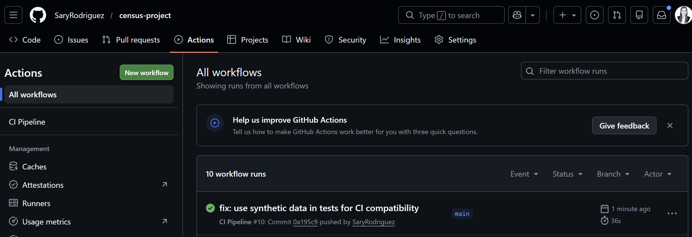
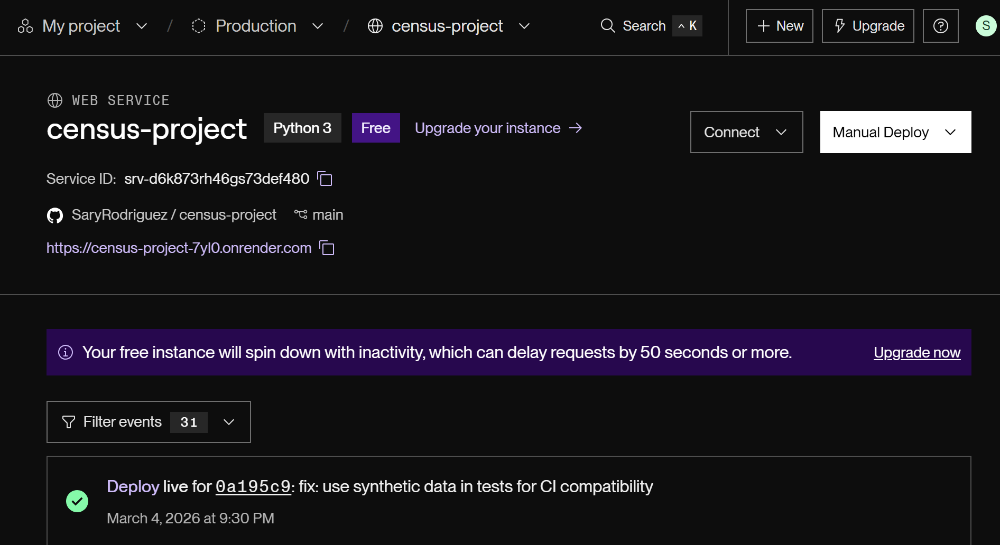
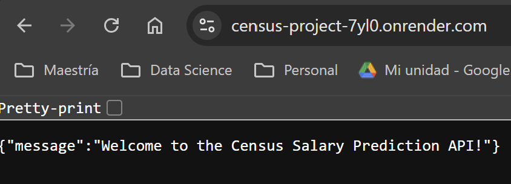
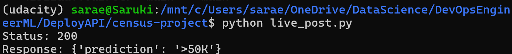
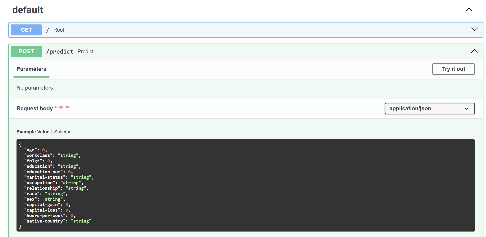

# Census Income Classifier - ML Pipeline with FastAPI

A machine learning project that predicts whether a person earns more or less than $50K/year based on census data. Includes a REST API deployed on Render with CI/CD via GitHub Actions.

## Project Structure
```
census-project/
├── data/
│   ├── census.csv
│   └── census_clean.csv
├── model/
│   ├── train_model.py
│   ├── model.pkl
│   └── encoder.pkl
├── tests/
│   ├── test_model.py
│   └── test_api.py
├── .github/
│   └── workflows/
│       └── ci.yml
├── main.py
├── live_post.py
├── slice_output.txt
├── model_card.md
├── requirements.txt
└── Procfile
```

## Setup

### 1. Clone the repository
```bash
git clone https://github.com/SaryRodriguez/census-project.git
cd census-project
```

### 2. Create and activate environment
```bash
conda create -n udacity python=3.8
conda activate udacity
pip install -r requirements.txt
```

### 3. Train the model
```bash
python model/train_model.py
```

## Running Tests
```bash
pytest tests/ -v
```

## Running the API Locally
```bash
uvicorn main:app --reload
```
Then open: http://127.0.0.1:8000/docs

## Live API
The API is deployed on Render:
- **GET** https://census-project-7yl0.onrender.com/
- **POST** https://census-project-7yl0.onrender.com/predict
- **Docs** https://census-project-7yl0.onrender.com/docs

## Query the Live API
```bash
python live_post.py
```

## CI/CD
- GitHub Actions runs `pytest` and `flake8` on every push to `main`
- Render auto-deploys when CI passes




## Screenshots




## Dataset
UCI Adult Census Income Dataset. Contains demographic information used to predict income level.

## Model
Random Forest Classifier. See [model_card.md](model_card.md) for full details.
